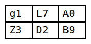

# svg-grid.py

Simple Python script to convert a CSV file into a SVG grid with uniformly-sized cells.



## usage:

```
usage: svg-grid.py [-d DELIMITER] [--margin MARGIN] [--line-width LINE_WIDTH] [--line-color LINE_COLOR]
                   [--cell-width CELL_WIDTH] [--cell-height CELL_HEIGHT] [--font-size FONT_SIZE]
                   [--font-family FONT_FAMILY] [-o OUT_FILE]
                   [filename]

positional arguments:
  filename              CSV file. Defaults to standard input

options:
  -d DELIMITER, --delimiter DELIMITER
                        character separating input fields
  --margin MARGIN       margin around SVG grid in px
  --line-width LINE_WIDTH
                        width of grid lines in px
  --line-color LINE_COLOR
                        color of grid lines
  --cell-width CELL_WIDTH
                        width of table cells in px
  --cell-height CELL_HEIGHT
                        height of table cells in px
  --font-size FONT_SIZE
  --font-family FONT_FAMILY
  -o OUT_FILE, --output OUT_FILE
                        Output file. Defaults to standard output
```
